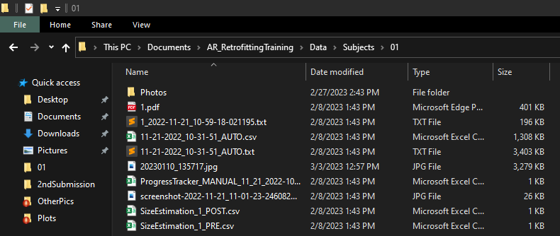

# Data Organization

## Data Processing

Essential files to know in this directory are listed below. Instructions on running individual scripts are found in the Python files. Its is recommened a **Python 3.8.10** virtual environment named *env* is created at the base of the *Data* directory. 

1. *ProgressTracker.py* - Python application used to manually track sub-task completion time. Will need to be updated to match task structure in Unity project or own custom tasks.
2. *RedrawWallArt.py* - Python application used to show participants drawing process.
3. *RetrofittingParser.py* - Single-subject data processing. Turns raw HoloLens 2 Unity output into a more usable .csv file. Should be run on every subject.
4. *RetrofittingPlotter.py* - Debug plotting to quickly view data. Questionable validity. Mostly carried over from another project and havent tested in a while.
5. *WallArtTool.py* - Python Application used to draw, and drawings can be later re-drawn using another script. Designed for a *Microsoft Surface Pro 4* and pens that work on that system. Cannot guarantee it works on other systems.
6. *WallEstimator.py* - Python application where estimated wall cutout ares are made by participants.

Batch files used to quickly some of these applications are included as well.

1. *RunDrawingApp.bat* - Launches drawing application script.
2. *RunProgressTracker_AR.bat* - Launches progress tracker script.
3. *RunProgressTracker_Paper.bat* - Launches progress tracker script.
4. *RunScripts.bat* - Launches single participant data processing and plotting scripts.
5. *RunWallEstimatorApp.bat* - Launches wall estimator script.

## Recommended Structure

Subject data should be placed in folders in the *Subjects* folder. Every subject has their own folder titled after their integer Participant ID. An example of what a typical subject directory should look like is shown in the image below.

1. *Photos* - Contains the pictures of the wall used to record participant progress.
2. *1.pdf* - Consent form.
3. *1_2022-11-21_10-59-18-021195.txt* - Drawing application output data.
4. *11-21-2022_10-31-51_AUTO.csv* - Python-processed experiment data.
5. *11-21-2022_10-31-51_AUTO.txt* - Raw experiment data from HoloLens 2.
6. *20230110_135717.jpg* - Image of notes taken during study.
7. *ProgressTracker_MANUAL_11_21_2022-10_32_31_518410.csv* - Output from experiment progress tracker Python application.
8. *screenshot-2022-11-21_11-01-23-2460820001.jpg* - Image of drawing application drawing.
9. *SizeEstimation_1_POST.csv* - Post-experiment cutout area estimation (Python application output).
10. *SizeEstimation_1_PRE.csv* - PRE-experiment cutout area estimation (Python application output).

## Camera Info

Images captured by a camera were used for wall cutout area estimation. The images are first perspective/calibration corrected using *OpenCV* and then the cutout areas were manually tagged using the *PerspectiveCorrection.py* script.

Special thanks to the following sources:

1. [https://pyimagesearch.com/2014/08/25/4-point-opencv-getperspective-transform-example/](https://pyimagesearch.com/2014/08/25/4-point-opencv-getperspective-transform-example/)
2. [https://pysource.com/2021/05/28/measure-size-of-an-object-with-opencv-aruco-marker-and-python/#](https://pysource.com/2021/05/28/measure-size-of-an-object-with-opencv-aruco-marker-and-python/#)

## Participant Plotting

Transform and study conditions are logged by the *HoloLens 2* at a rate of 5 hz. Once this data is processed and converted to a CSV file (see above), it can be plotted in **Rhinocerous 6** and **Grasshopper**. These script and a primitive re-creation of the test environment are found in the *RhinoPlotting* folder.